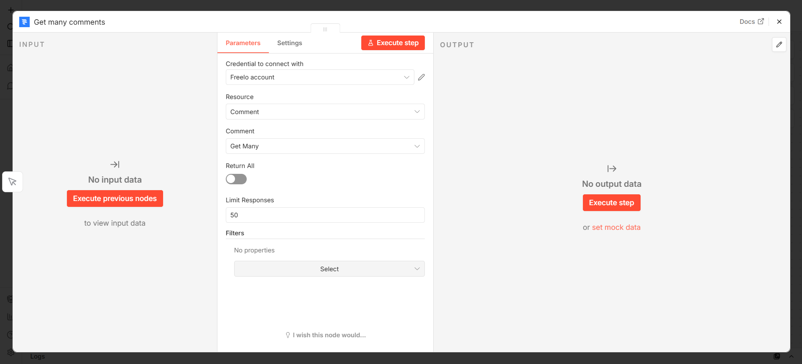

# n8n and Freelo Integration

Freelo offers integration with [n8n](https://n8n.io/) –
an open-source automation platform. The integration
allows you to connect to hundreds of other applications
through the Freelo Node and create your own
automated processes. All you need to do is set up
a so-called *workflow*, which **will perform the
desired actions 24 hours a day without any
intervention on your part.**


## Installation via n8n Marketplace

The easiest way to install is directly through the official n8n Marketplace:

1. In n8n, go to the **Nodes** section in the left panel.
2. Search for **Freelo**.
3. Click **Install**.

The node will be installed automatically and is immediately ready to use.


---

## Connecting Your Freelo Account to n8n

Once you add a Freelo node to your workflow, you need to connect your Freelo account.

### What You'll Need

- A Freelo account – you can create one at [app.freelo.io](https://app.freelo.io/)
- An [API key](https://www.freelo.io/cs/napoveda/api-klic) – found in your Freelo account settings

### Steps

1. In n8n, open any Freelo node.
2. In the **Credential for Freelo API** field, click **Create New**.
3. Fill in:
    - **Email** – the email of your Freelo account
    - **API Key** – the API key from your Freelo settings
4. Click **Save**.


The node will verify the connection to the Freelo API. After successful verification, the credential is saved and you can use it across all Freelo nodes within your n8n instance.

> **TIP:** n8n supports hundreds of other applications, which you can browse in the [integrations library](https://n8n.io/integrations/). If the desired application is not available, you can use the HTTP Request node – which makes any application with an API connectable.

---

## Working with Workflows

Automations you create in n8n are called **workflows**. Each workflow consists of nodes (modules) that are connected to each other and pass data between them.

### Creating a Workflow

For your desired process, select the first application and the action to be performed in it using the **+** icon. Each application offers many specific actions that can be performed.

1. On the n8n main page, click **Add workflow**.
2. Using the **+** icon, add the first node – a trigger that will react to events in Freelo.
3. Continue adding more nodes that will process the incoming data – for example, sending a message to Slack or writing a row to Google Sheets.


### Activating a Workflow

Once the workflow is complete, don't forget to **activate** it using the toggle in the top right corner. Without activation, the workflow does not respond to incoming events.

> **Note:** In the Freelo and n8n integration, amounts use two decimal places but without a decimal point. For example, the value 102.05 CZK is passed as `10205`.

---

## Freelo Node

The main node for working with data in Freelo. When added to a workflow, you select a **Resource** (object type) and an **Operation** (action).



---

## Practical Examples

### Freelo and Slack

By connecting Freelo and Slack, you can receive messages in your selected channel for various events in Freelo – a newly created task, an updated work report, or a new comment on a task.


---

### Freelo and Google Sheets

You can send work reports from Freelo directly to Google Sheets, allowing you to work with this data in a spreadsheet editor.


1. **Schedule Trigger** – set the frequency (e.g., every day at 18:00).
2. **Freelo** node – resource *Work Report*, operation *Get Many*, optionally filter by date.
3. **Google Sheets** – map the columns (date, task, time, note…).

---


### Freelo and GitLab/GitHub

You can create a task directly from GitLab into Freelo. If you have an issue in GitLab that you also need as a task in Freelo, create this connection:

```
[GitLab Trigger: Issue Created] → [Freelo: Create Task]
```
