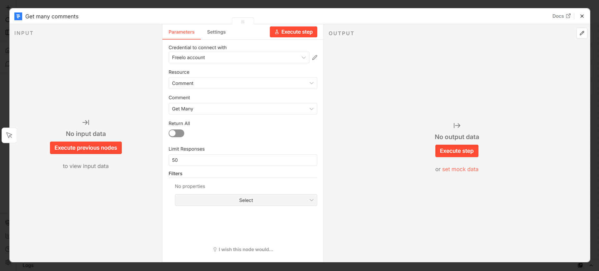

# Integrace n8n a Freelo

Freelo nabízí propojení s [n8n](https://n8n.io/) –
open-source automatizační platformou. Integrace
vám umožní prostřednictvím Freelo Node napojit na
stovky dalších aplikací a vytvořit si tak vlastní
automatizované procesy. Je k tomu potřeba pouze
vyklikat správně tzv. *workflow*, které **bude
požadované akce dělat 24 hodin denně bez vašeho
zásahu.**


## Instalace přes n8n Marketplace

Nejjednodušší způsob instalace je přímo přes oficiální n8n Marketplace:

1. V n8n přejděte do sekce **Nodes** v levém panelu.
2. Vyhledejte **Freelo**.
3. Klikněte na **Install**.

Node se nainstaluje automaticky a je ihned připraven k použití.


---

## Propojení Freelo účtu s n8n

Jakmile do workflow přidáte Freelo node, je potřeba propojit váš Freelo účet.

### Co budete potřebovat

- Účet ve Freelu – lze vytvořit na [app.freelo.io/signup](https://app.freelo.io/signup)
- [API klíč](https://help.freelo.io/help/api-klic/) – najdete ho v nastavení vašeho Freelo účtu

### Postup

1. V n8n otevřete libovolný Freelo node.
2. V poli **Credential for Freelo API** klikněte na **Create New**.
3. Vyplňte:
    - **Email** – e-mail vašeho Freelo účtu
    - **API Key** – API klíč z nastavení Freela
4. Klikněte na **Save**.


Node ověří spojení s Freelo API. Po úspěšném ověření je credential uložen a můžete ho používat ve všech Freelo nodes v rámci vaší n8n instance.

> **TIP:** n8n podporuje stovky dalších aplikací, které si můžete prohlédnout v [knihovně integrací](https://n8n.io/integrations/). Pokud požadovaná aplikace v nabídce není, můžete využít HTTP Request node – díky kterému je jakákoli aplikace s API napojitelná.

---

## Práce s workflow

Automatizacím, které v n8n vytvoříte, se říká **workflow**. Každé workflow se skládá z nodů (modulů), které na sebe navazují a předávají si data.

### Vytvoření workflow

Pro svůj požadovaný proces vyberte přes ikonu **+** první aplikaci a akci, která v ní má probíhat. Každá aplikace nabízí spoustu specifických akcí, které v ní lze dělat.

1. Na hlavní stránce n8n klikněte na **Add workflow**.
2. Přes ikonu **+** přidejte první node – spouštěč, který bude reagovat na události ve Freelu.
3. Pokračujte přidáváním dalších nodů, které budou příchozí data zpracovávat – například odeslat zprávu do Slacku nebo zapsat řádek do Google Sheets.


### Aktivace workflow

Jakmile je workflow hotové, nezapomeňte ho **aktivovat** přepínačem v pravém horním rohu. Bez aktivace workflow nereaguje na příchozí události.

> **Pozor:** V integraci Freela a n8n se u částek využívají dvě desetinná místa, ale bez desetinné čárky. Tj. hodnota 102,05 Kč se předává jako `10205`.

---

## Freelo node 

Hlavní node pro práci s daty ve Freelu. Při přidání do workflow zvolíte **Resource** (typ objektu) a **Operation** (akci).



---

## Praktické příklady

### Freelo a Slack

Díky propojení Freela a Slacku můžete dostávat do vámi vybraného kanálu zprávy na různé události ve Freelu – nově vytvořený úkol, upravený výkaz nebo třeba nový komentář u úkolu.


---

### Freelo a Google Sheets

Výkazy z Freela můžete posílat rovnou do Google Sheets, a tak s těmito daty pracovat přímo v tabulkovém editoru.


1. **Schedule Trigger** – nastavte frekvenci (např. každý den v 18:00).
2. **Freelo** node – resource *Work Report*, operation *Get Many*, volitelně filtr na datum.
3. **Google Sheets** – namapujte sloupce (datum, úkol, čas, poznámka…).

---


### Freelo a GitLab/GitHub

Můžete vytvořit úkol přímo z GitLabu do Freela. Pokud máte v GitLabu issue, ze kterého potřebujete mít následně ještě úkol ve Freelu, vytvořte toto propojení:

```
[GitLab Trigger: Issue Created] → [Freelo: Create Task]
```


